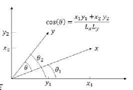

## 1 向量

### 1.1 向量的概念

* 定义

  * 数域$F$上的$n$个数$a_1,a_2,...,a_n$所组成的有序数组$[a_1,a_2,...,a_n]$称为$n$维向量，其中第$i$个数称为该向量的第$i$个分量.

    通常用加粗小写字母***a***，***b***表示.

* 行向量、列向量 $\alpha = (a_1,a_2,...,a_n)$、$\begin{aligned} \beta = \left( \begin{array}{c} b_1 \\ b_2 \\ \vdots \\ b_n \end{array}\right) =(b_1,b_2,...,b_n)^T \end{aligned}$

* 向量的线性运算

  * 向量相等 
    $$
    a = (a_1,a_2,...,a_n), b = (b_1,b_2,...,b_n), a=b \Leftrightarrow a_i=b_i(i=1,2,...,n)
    $$

  * 加法 
    $$
    a \pm b = (a_1,a_2,...,a_n) \pm (b_1,b_2,...,b_n) = (a_1 \pm b_1,a_2 \pm b_2,...,a_n \pm b_n)
    $$

  * 数乘 
    $$
    ka = k(a_1,a_2,...,a_n) = (ka_1,ka_2,...,ka_n)
    $$

  * 运算律 
  
        		1. $\textbf{a}+\textbf{b}=\textbf{b}+\textbf{a}$
        2. $(\textbf{a}+\textbf{b})+\textbf{c}=\textbf{a}+(\textbf{b}+\textbf{c})$
        3. $k(\textbf{a}+\textbf{b})=k\textbf{a}+k\textbf{b}$
        4. $(k+l)\textbf{a}=k\textbf{a}+l\textbf{a}$

### 1.2 向量的模与角度

* 向量内积

  * 给定$R^n$中的向量$a = (a_1,a_2,...,a_n)^T,b=(b_1,b_2,...,b_n)^T$，称实数
    $$
    \sum_{i=1}^{n}a_ib_i=a_1b_1+a_2b_2+...+a_nb_n
    $$
    为$a$和$b$的内积，记为$a^Tb$.

* 内积运算性质
  * 设$\alpha,\beta,\gamma$是$R^n$中的向量，$k$是实数：
    1. $\alpha ^T \beta = \beta ^T \alpha$
    2. $(k\alpha)^T \beta = k(\alpha^T \beta) = \alpha ^T (k \beta)$
    3. $(\alpha + \beta)^T \gamma = \alpha ^T \gamma + \beta ^T \gamma$
    4. $\alpha ^T \alpha = 0 \Leftrightarrow \alpha = 0$

* 向量的长度（向量的模）

  * 给定$R^n$中的向量$a = (a_1,a_2,...,a_n)^T,b=(b_1,b_2,...,b_n)^T$，称实数
    $$
    \sqrt{a^Ta} = \sqrt{a_1^2+a_2^2+...+a_n^2} = \sqrt{\sum_{i=1}^na_i^2}
    $$

​				为向量$a$的长度，记作$||a||$

* 向量模的性质

  * 非负性：$||a|| \geq 0$

  * 齐次性：$||ka|| = |k| \cdot ||a||$

  * 柯西不等式：
    $$
    \left|\sum_{i=1}^na_ib_i \right| \leq \sqrt{\sum_{i=1}^na_i^2}\sqrt{\sum_{i=1}^nb_i^2}
    $$
    ​	对于任意向量$a = (a_1,a_2,...,a_n)^T,b=(b_1,b_2,...,b_n)^T$，若$|a^Tb|\leq ||a||\cdot||b||$等号成立$\Leftrightarrow a,b$ 线性相关.

* 若向量$a$的模为1，则称$a$为单位向量。事实上，设非零向量$a$，令$\eta = \frac{a}{||a||}$，则$||\eta||=1$，方向与$a$相同.

* 向量夹角

  

  * 若$x=(x_1,x_2)^T,y=(y_1,y_2)^T$，则
    $$
    L_x=||x||=\sqrt{x_1^2+x_2^2} \ \ ,\ L_y=||y||=\sqrt{y_1^2+y_2^2}\\
    \cos(\theta_1)=\frac{x_1}{L_x} \ \ ,\ \cos(\theta_2)=\frac{x_2}{L_x}\\
    \sin(\theta_1)=\frac{x_1}{L_x} \ \ ,\ \sin(\theta_2)=\frac{x_2}{L_x}\\
    \cos(\theta)=\cos(\theta_2-\theta_1)=\cos(\theta_2)\cos(\theta_1)+\sin(\theta_2)\sin(\theta_1)\\=\frac{x_1y_1+x_2y_2}{L_xL_y}=\frac{x^Ty}{||x||\cdot||y||}
    $$
    
  * 当$x^Ty=0$时，$x$与$y$互相垂直.

* 向量正交（orthogonal）

  * 定义：若两个 $p$ 维向量 $a$ 和 $b$ 满足 $a^Tb=a_1b_1+a_2b_2+...+a_pb_p=0$，则称 $a$ 与 $b$ 正交.
  * 零向量与任何向量都正交
  * 与自己正交的向量只有零向量

* 正交向量组

  * 若非零向量组$(a_1,a_2,...,a_n)$中，向量两两正交，即$a_i^Ta_j=0(i \neq j)$，则称该向量组为正交向量组.

## 8 泰勒公式和线性化

### 8.1 泰勒公式

* 定义：

  若函数$f(x)$在$x_0$处有$n+1$阶导数，则存在$x_0$的一个邻域，对于该邻域内任一$x$，有
  $$
  f(x)=f(x_0)+f'(x_0)(x-x_0)+\frac{f^{(2)}(x_0)}{2!}(x-x_0)^2+...+\frac{f^{(n)}(x_0)}{n!}(x-x_0)^n+R_n(x)
  $$
  该式子称为函数$f(x)$在$x_0$的泰勒公式.

  其中，$R_n(x)=o((x-x_0)^n)$，称为拉格朗日余项，表示用$n$次泰勒多项式来近似表示$f(x)$所产生的误差. $R_n(x)$的具体表示为：
  $$
  R_n(x)=\frac{f^{n+1}(\xi)}{(n+1)!}(x-x_0)^{n+1}\ \ (\xi \in (x_0,x))
  $$
  当 $n=0$ 时，是拉格朗日中值公式：
  $$
  f(x)=f(x_0)+f'(\xi)(x-x_0)\ \ (\xi \in (x_0,x))
  $$
  当 $x_0=0$ 时，是麦克劳林公式：
  $$
  f(x)=f(0)+f'(\xi)x+\frac{f^{(2)}(0)}{2!}x^2+...+\frac{f^{(n)}(0)}{n!}x^n+R_n(x)\ \ (\xi \in (x_0,x))
  $$

### 8.2 Jacobian矩阵

#### 8.2.1 n维欧式空间

* 定义：

  所有 $n$ 个有序实数组$(x_1,x_2,...,x_n)$的全体称为 $n$ 维向量空间，或简称 $n$ 维空间，其中每个有序实数组称为 $n$ 维空间中的一个向量（或一个点），记作
  $$
  x=(x_1,x_2,...,x_n)^T
  $$
  设$x=(x_1,x_2,...,x_n)^T$与$y=(y_1,y_2,...,y_n)^T$ 是 $n$ 维空间中的任意两个向量，则向量$x$与$y$的内积定义为：
  $$
  x^Ty=x_1y_1+x_2y_2+...+x_ny_n
  $$
  定义了内积的 $n$ 维空间叫做 $n$ 维欧几里得空间（简称 $n$ 维欧式空间），记作$R^n$，利用内积定义向量$x \in R^n$的模为：
  $$
  |x|=\sqrt{x^Tx}=\sqrt{\sum_{i=1}^nx_i^2}
  $$

#### 8.2.2 向量函数与实值函数

* 实值函数

  $n$ 维空间中的点集到实数集的映射（$R^n \rightarrow R$）

* 向量函数

  $n$ 维欧式空间中的点集到 $m$ 维欧氏空间点集的映射（$R^n \rightarrow R^m$）

  一般地，当$f_1,f_2,...,f_m$为$f$的分量函数（或坐标函数）时，可写作
  $$
  f(x)=
  	\left(
  	\begin{array}{(c)} 
  	f_1(x) \\ 
  	\vdots \\ 
  	f_m(x)
  	\end{array}
  	\right)
  	=
  	\left(
  	\begin{array}{(c)} 
  	f_1(x_1,x_2,...,x_n) \\ 
  	\vdots \\ 
  	f_m(x_1,x_2,...,x_n)
  	\end{array}
  	\right)
  或
  f = 
  	\left(
  	\begin{array}{(c)} 
  	f_1 \\ 
  	\vdots \\ 
  	f_m
  	\end{array}
  	\right)
  $$
  两个相同维数的向量函数 $f$ 和 $g$ 在相同的定义域上的和（差）函数为：
  $$
  f \pm g = 
  	\left(
  	\begin{array}{c}
  	 f_1 \pm g_1 \\ 
  	 \vdots \\
  	 f_n \pm g_n
       \end{array}
       \right)
  $$
  一个实值函数 $\alpha$ 向量函数 $f$ 在相同的定义域上的乘积函数为：
  $$
  \alpha f = 
  	\left(
  	\begin{array}{c}
  	\alpha f_1 \\
  	\vdots \\
  	\alpha f_n
  	\end{array}
  	\right)
  $$
  两个向量函数 $f$ 和 $h$ 的复合函数为：
  $$
  h \vdot f = 
  	\left(
  	\begin{array}{c}
  	h_1 \vdot f \\
  	\vdots \\
  	h_n \vdot f
  	\end{array}
  	\right)
  $$

#### 8.2.3 梯度

* 根据自变量和因变量的不同可分为：

1. 自变量为实向量的标量函数 $f$ 关于向量的梯度：

   函数 $f$ 关于行向量 $x^T$ 的梯度为：
   $$
   \frac{\partial f}{\partial x^T} = [\frac{\partial f}{\partial x_1},...,\frac{\partial f}{\partial x_n}] = \nabla_{x^T}f(x)
   $$
   函数 $f$  关于列向量 $x$ 的梯度计算公式为：
   $$
   \frac{\partial f}{\partial x} = [\frac{\partial f}{\partial x_1},...,\frac{\partial f}{\partial x_n}]^T = \nabla_{x}f(x)
   $$
   若 $f$ 为常数，则对应的梯度为**0**.

2. 自变量为实向量（$x_{n \times 1}$）的向量函数 $f$ 关于向量的梯度：
   $$
   f \in R^m,\ 
   \nabla_xf = 
   	\left[
   	\begin{matrix}
   	\frac{\partial f_1}{\partial x_1} & \frac{\partial f_2}{\partial x_1} & \cdots & \frac{\partial f_m}{\partial x_1} \\
   	\frac{\partial f_1}{\partial x_2} & \frac{\partial f_2}{\partial x_2} & \cdots & \frac{\partial f_m}{\partial x_2} \\
   	\vdots & \vdots & \ddots & \vdots \\
   	\frac{\partial f_1}{\partial x_n} & \frac{\partial f_2}{\partial x_n} & \cdots & \frac{\partial f_m}{\partial x_n}
   	\end{matrix}
   	\right]
   	= \frac{\partial f}{\partial x}
   $$

3. 自变量为矩阵（$x_{m \times n}$）的标量函数 $f$ 关于矩阵的梯度：
   $$
   f \in R,\ 
   \nabla_Xf = 
   	\left[
   	\begin{matrix}
   	\frac{\partial f_1}{\partial x_{11}} & \frac{\partial f_2}{\partial x_{12}} & \cdots & \frac{\partial f_m}{\partial x_{1n}} \\
   	\frac{\partial f_1}{\partial x_{21}} & \frac{\partial f_2}{\partial x_{22}} & \cdots & \frac{\partial f_m}{\partial x_{2n}} \\
   	\vdots & \vdots & \ddots & \vdots \\
   	\frac{\partial f_1}{\partial x_{m1}} & \frac{\partial f_2}{\partial x_{m2}} & \cdots & \frac{\partial f_m}{\partial x_{mn}}
   	\end{matrix}
   	\right]
   	= \frac{\partial f}{\partial X}
   $$

* 运算法则

  * 加法法则：若 $f(x),g(x)$ 均为 $x$ 的实值函数，则
    $$
    \frac{\partial[pf(x)+qg(x)]}{\partial x}=p\frac{\partial f(x)}{\partial x}+q\frac{\partial g(x)}{\partial x}
    $$

  * 乘法法则：若 $f(x),g(x)$ 均为 $x$ 的实值函数，则
    $$
    \frac{\partial[f(x)g(x)]}{\partial x}=f(x)\frac{\partial g(x)}{\partial x}+g(x)\frac{\partial f(x)}{\partial x}
    $$

  * 除法法则：若 $f(x)$ 为向量 $x$ 的向量值函数，则
    $$
    \frac{\partial[f(x)/g(x)]}{\partial x}=\frac{1}{g^2(x)}\left[g(x)\frac{\partial f(x)}{\partial x}-f(x)\frac{\partial g(x)}{\partial x}\right]
    $$

  * 链式法则：若$g(x)$为$x$的向量值函数，则
    $$
    \frac{\partial g(f(x))}{\partial x}=\frac{\partial g(f)}{\partial f}\frac{\partial f(x)}{\partial x}
    $$

* 常见类型的梯度
  $$
  \nabla(x^Tx)=\frac{\partial x^Tx}{\partial x} = 2x,\ \ \ \nabla(a^Tx)=\frac{\partial a^Tx}{\partial x} = a,\\
  \nabla(x^TA)=\frac{\partial x^TA}{\partial x} = A,\ \ \ \nabla(x^TAx)=\frac{\partial x^TAx}{\partial x} = (A+A^T)x
  $$
  

#### 8.2.4 Jacobian矩阵

若函数$f(x):\mathbb{R}^n \rightarrow \mathbb{R}^m$，有：
$$
x=[x_1,x_2,...,x_n]^T,\ 
f(x)=
	\left[
	\begin{array}{c}
	f_1(x_1,x_2,...,x_n) \\
	f_2(x_1,x_2,...,x_n) \\
	\vdots \\
	f_m(x_1,x_2,...,x_n)
	\end{array}
	\right]
$$
则Jacobian矩阵$J(x)$可以写为：
$$
f \in \mathbb{R}^{m \times 1},\ 
J(x) =
	\left[
	\begin{matrix}
	\frac{\partial f_1}{\partial x_1} & \frac{\partial f_1}{\partial x_2} & \cdots & \frac{\partial f_1}{\partial x_n} \\
	\frac{\partial f_2}{\partial x_1} & \frac{\partial f_2}{\partial x_2} & \cdots & \frac{\partial f_2}{\partial x_n} \\
	\vdots & \vdots & \ddots & \vdots \\
	\frac{\partial f_m}{\partial x_1} & \frac{\partial f_m}{\partial x_2} & \cdots & \frac{\partial f_m}{\partial x_n}
	\end{matrix}
	\right]
	= \nabla_x^T f
$$
Jacobian矩阵表现了向量函数的最佳线性逼近，也即
$$
f(x) \approx f(p) + J(p)(x-p)
$$

### 8.3 Hessian 矩阵

 若$f:\mathbb{R}^n \rightarrow \mathbb{R}$为二次可导函数，$x=[x_1,x_2,...,x_n]^T$，则$f$ 的Hessian矩阵为：
$$
H(f)=
	\left[
	\begin{matrix}
	\frac{\partial^2 f}{\partial x_1 \partial x_1} & \frac{\partial^2 f}{\partial x_1 \partial x_2} & \cdots & \frac{\partial^2 f}{\partial x_1 \partial x_n} \\
	\frac{\partial^2 f}{\partial x_2 \partial x_1} & \frac{\partial^2 f}{\partial x_2 \partial x_2} & \cdots & \frac{\partial^2 f}{\partial x_2 \partial x_n} \\
	\vdots & \vdots & \ddots & \vdots \\
	\frac{\partial^2 f}{\partial x_n \partial x_1} & \frac{\partial^2 f}{\partial x_n \partial x_2} & \cdots & \frac{\partial^2 f}{\partial x_n \partial x_n}
	\end{matrix}
	\right]
	=
	\nabla_x^2f
$$
Hessian矩阵使用了函数的二阶信息，常用于解决优化问题.

当$f$的二阶混合偏导数连续时，它是一个对称矩阵.

这时，$f$在$x_0$的二阶泰勒公式可简单地写成：
$$
f(x)=f(x_0)+f'(x_0)(x-x_0)+\frac{1}{2}(x-x_0)^Tf^2(x_0)(x-x_0)+o(|x-x_0|^2)
$$

## 13 贝叶斯决策理论和HMM

### 13.1 贝叶斯决策理论

#### 13.1.1 贝叶斯定理

* 设$n$个事件$A_1,A_2,...,A_n$两两互斥，$A_1+A_2+...+A_n=\Omega$（满足这两个条件的事件组称为一个完备事件组），且$P(A_i)>0(i=1,2,...,n)$则
  $$
  P(A_i|B)=\frac{P(A_i)P(B|A_i)}{\sum_{j=1}^nP(A_i)P(B|A_j)}
  $$

* $P(A_i|B)$是在事件$B$发生的条件下，某个原因$A_i$发生的概率，称为后验概率，称$P(A_i)$为先验概率.

#### 13.1.2 MLE、MAP和Bayesian

令：

* $D={(x_1,y_1),...,(x_n,y_n)}$表示训练样本集
* $\theta$表示模型所有的参数
* $x^*$表示一个新的样本（训练完的模型需要做预测），$\hat y$表示模型对新样本的预测值

##### 13.1.2.1 最大似然估计（Maximum likelihood estimation, MLE）

* 在给定一个模型参数的情况下，计算样本集的概率$p(D|\theta)$
* 目标是找到最优的参数$\theta^*$使得$p(D|\theta)$最大化
* 预测$p(\hat y|x^*,\theta^*)$

目标：
$$
\theta^*_{MLE}=arg\max_\theta p(D|\theta)
$$
要找到最优参数$\theta^*$使得$p(D|\theta)$最大化，通常可通过令导数等于0等到：
$$
\frac{\partial p(D|\theta)}{\partial \theta}=0
$$
MLE未考虑到先验，且容易造成过拟合.

##### 13.1.2.2 最大后验估计（Maximum a posteriori estimation,MAP）

* 在给定样本的情况下，计算参数的概率$p(\theta|D)$
* 目标是找到最优的参数$\theta^*$使得$p(\theta|D)$最大化
* 预测$p(\hat y|x^*,\theta^*)$

目标：
$$
\theta^*_{MAP}=arg\max_\theta p(\theta|D)
$$
根据贝叶斯公式有：
$$
p(\theta|D)=\frac{p(D|\theta)p(\theta)}{p(D)}
$$
目标可以转为：
$$
\theta^*_{MAP}=arg\max_\theta p(D|\theta)p(\theta)
$$
进一步取对数形式：
$$
\theta^*_{MAP}=arg\max_\theta log\ p(D|\theta)+log\ p(\theta)
$$
MAP与MLE最大不同在于$p(\theta)$项，MAP解决了MLE缺乏先验的缺点

##### 13.1.2.3 贝叶斯估计（Bayesian estimation）

* 在给定样本的情况下，计算参数的分布$p(\theta|D)$
* 预测$p(\hat y|x^*,D)=\int_\theta p(\hat y|x^*,\theta)p(\theta|D)d\theta$

目标：

对于一个新样本$x^*$，模型的预测为：
$$
p(\hat y|x^*,D)=\int_\theta p(\hat y|x^*,\theta)p(\theta|D)d\theta
$$
需要计算后验概率$p(\theta|D)$：
$$
p(\theta|D)=\frac{p(D|\theta)p(\theta)}{\int p(D|\theta)p(\theta)d\theta}
$$
后验概率需要近似计算.

#### 13.1.2 蒙特卡洛方法

通过随机抽样方法，以随机事件出现的频率估计其概率，或者以抽样的数字特征估算随机变量的数字特征，并将其作为问题的解

### 13.2 隐马尔科夫模型（Hidden Markov Model, HMM）

* 隐马尔科夫模型
  * 一种简单的有向图模型，常用于处理时间序列数据
  * 在多个领域应用广泛：语音识别、自然语言处理、词性标注等等
* HMM的变量分为两种
  * 因变量			$y \in Y$ ：在$i$时刻系统所处的状态（通常离散型）
  * 观察变量        $x \in X$ ：在$i$时刻所处的观察值（离散、连续）

下一个状态仅由当前状态决定，与其他状态变量无关

* x在给定y的情况下条件独立，HMM中因变量和观察变量的联合分布可以写为
  $$
  p(\textbf{x}_{1:T},\textbf{y}_{1:T})=p(y_1)p(x_1|y_1)\prod_{t=2}^Tp(x_t|y_t)p(y_t|y_{t-1})\\
  \textbf{x}_{1:T}=(x_1,x_2,...,x_T)\\
  \textbf{y}_{1:T}=(y_1,y_2,...,y_T)
  $$
